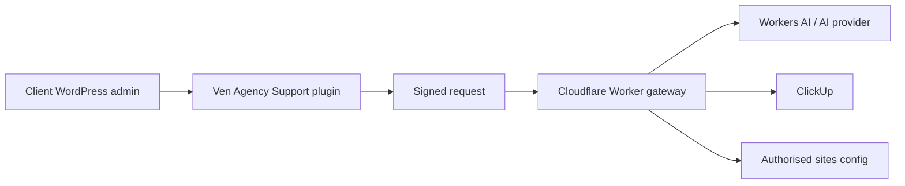

# Ven Agency Support

Ven Agency Support is the WordPress admin support assistant used by Ven Agency to provide authorised client websites with guided help, AI-assisted troubleshooting, ClickUp support task creation, file uploads, and optional temporary support access.

This repository is the source of truth for the support assistant. Client website repositories should only consume the released WordPress plugin and point it at the Ven-managed Cloudflare Worker gateway.

## What This Project Contains

- `ven-agency-support/` - the WordPress plugin installed on authorised client websites.
- `cloudflare/ven-support-task-gateway/` - the Ven-managed Cloudflare Worker gateway.
- `.github/workflows/release.yml` - release packaging for WordPress plugin ZIPs.
- `readme.txt` - WordPress plugin metadata and changelog.
- `docs/` - operating notes for site authorisation, security, releases, and client installation.

## Architecture

The product is split deliberately:

1. The WordPress plugin renders the admin assistant UI, checks the logged-in user's WordPress capability, collects support request details, stores uploaded files in WordPress, signs gateway requests, and can grant temporary Ven support access when an administrator chooses to allow it.
2. The Cloudflare Worker verifies the client site, controls feature flags, calls Workers AI or the fallback AI provider, and creates ClickUp tasks using Ven-held credentials.
3. Client WordPress sites never receive the ClickUp API token or AI provider credentials.



## WordPress Plugin

Install the latest release ZIP from GitHub Releases, then activate **Ven Agency Support** in WordPress.

Configure each client site in `wp-config.php` or through host-level environment constants:

```php
define( 'VEN_SUPPORT_GATEWAY_URL', 'https://ven-support-task-gateway.ven-agency.workers.dev' );
define( 'VEN_SUPPORT_SITE_ID', 'tws-ven-com-au' );
define( 'VEN_SUPPORT_SITE_SECRET', getenv( 'VEN_SUPPORT_SITE_SECRET' ) );
```

The site ID and secret must match the matching entry in the Worker's `AUTHORIZED_SITES` secret.

Legacy `TW_SOLAR_SUPPORT_*` constants are still supported by the plugin so the first production install can migrate without breaking, but new sites should use the `VEN_SUPPORT_*` constants.

## Cloudflare Worker Gateway

The Worker lives in `cloudflare/ven-support-task-gateway/`.

Required Cloudflare Worker secrets:

- `AUTHORIZED_SITES` - JSON map of allowed client sites.
- `CLICKUP_TOKEN` - Ven Agency ClickUp API token.

Optional Worker variables or secrets:

- `DEFAULT_CLICKUP_LIST_ID` - fallback ClickUp list when a site entry does not include `clickupListId`.
- `OPENAI_API_KEY` - fallback AI provider key when Workers AI is not bound.
- `OPENAI_MODEL` - fallback model name.
- `OPENAI_MAX_OUTPUT_TOKENS` - fallback output limit.

The Worker is configured for Workers AI and defaults to `@cf/google/gemma-4-26b-a4b-it` through the `CF_AI_MODEL` variable in `wrangler.jsonc`.

## Authorising A Site

Add a site entry to the `AUTHORIZED_SITES` Worker secret.

```json
{
  "tws-ven-com-au": {
    "enabled": true,
    "chatEnabled": true,
    "ticketsEnabled": true,
    "secret": "<site-specific-shared-secret>",
    "allowedOrigins": ["https://tws.ven.com.au"],
    "clickupListId": "901611479405",
    "tags": ["tw-solar"],
    "title": "Ven Support",
    "intro": "Ask Ven for help with this website.",
    "aiModel": "@cf/google/gemma-4-26b-a4b-it",
    "aiInstructions": "You are Ven Agency website support. Keep replies concise and route implementation work to a support request."
  }
}
```

Use a long random shared secret per client site. Keep it in the client host's secure environment or `wp-config.php`, not in a theme repository.

Set `enabled` to `false` to remotely hide the assistant for a site after the plugin's short settings cache expires.

## Request Flow

1. WordPress requests `/site-config` to check whether the assistant is enabled.
2. The plugin renders the assistant only when the Worker says the site is enabled.
3. Chat and ticket requests are signed with `HMAC-SHA256(timestamp.body)`.
4. The Worker verifies site ID, timestamp freshness, signature, and allowed origin.
5. Chat requests are routed through Ven-controlled AI.
6. Support requests create ClickUp tasks in the configured list.
7. If temporary access is requested, WordPress creates or refreshes the Ven support user and includes a short-lived one-time login link in the ClickUp task.

## Security Model

- Every site has its own site ID and shared secret.
- The Worker rejects requests with missing headers, old timestamps, invalid signatures, or unapproved origins.
- ClickUp and AI credentials are stored only in Ven-controlled Cloudflare Worker secrets.
- Temporary WordPress access is opt-in from the support form and only available to administrators.
- The access user uses `dev@ven.com.au`.
- The assistant does not execute arbitrary PHP, SQL, JavaScript, shell commands, or filesystem writes.
- AI tool calls are rendered as suggested actions unless a future explicit, capability-gated WordPress endpoint applies a narrow approved change.

## AI And Tool Use

The current Worker exposes these safe tools to the AI layer:

- `open_admin_screen` - suggests a safe WordPress admin URL.
- `propose_page_change` - drafts a page/content change for user review.
- `prepare_support_request` - prepares a support request draft.

The current WordPress plugin renders returned tool calls as actions. It does not directly apply content changes.

Future page-changing tools should be implemented as narrow, signed, capability-gated WordPress endpoints with user confirmation and a rollback path.

## Local Development

Install the project tools:

```sh
npm install
```

Prepare local-only WordPress and Worker configuration:

```sh
npm run local:setup
```

This creates or updates ignored local files:

- `.wp-env.override.json` - WordPress constants for the local test site.
- `cloudflare/ven-support-task-gateway/.dev.vars` - local Worker authorisation config.

The setup script generates a local shared secret and keeps it in those ignored files. Do not commit either file. Do not add fake ClickUp, AI, or client credentials. Add real development credentials to `.dev.vars` only when intentionally testing chat AI responses or ClickUp task creation.

Start the local Worker gateway in one terminal:

```sh
npm run worker:dev
```

The Worker dev server listens on `8796` by default so it stays separate from other local services.

Start WordPress in a second terminal:

```sh
npm run wp:start
```

The local WordPress admin is available at `http://localhost:8896/wp-admin/` with the default `wp-env` username `admin` and password `password`. The `ven-agency-support/` plugin is loaded by `.wp-env.json`; if you need to reactivate it manually, run:

```sh
npm run wp:activate
```

Check the plugin status:

```sh
npm run wp:verify
```

Stop WordPress:

```sh
npm run wp:stop
```

If you change the WordPress or Worker port, rerun `npm run local:setup` with `VEN_SUPPORT_LOCAL_WORDPRESS_URL`, `VEN_SUPPORT_LOCAL_GATEWAY_URL`, or `VEN_SUPPORT_LOCAL_SITE_ID` set to the exact local values you are using.

Lint the plugin PHP through the wp-env CLI container:

```sh
npm run plugin:lint
```

Build a plugin ZIP locally:

```sh
npm run plugin:zip
```

Deploy the Worker:

```sh
npm run worker:deploy
```

## Releases And Updates

Client WordPress installs receive plugin update notices from GitHub Releases.

Release process:

1. Update the plugin header version, `Ven_Agency_Support::VERSION`, and `readme.txt` stable tag/changelog.
2. Run `npm run plugin:lint`.
3. Commit and push to `main`.
4. Create a GitHub release such as `v1.3.5`.
5. The release workflow attaches `ven-agency-support.zip` to the release.
6. WordPress will surface the update on the Plugins screen during its next update check.

Manual release ZIP:

```sh
npm run plugin:zip
gh release create v1.3.5 ven-agency-support.zip --repo venagency/ven-agency-support --title "Ven Agency Support 1.3.5" --notes "Release notes"
```

## Client Website Repositories

Client website repositories should not own the support assistant internals. They should:

- install the released plugin ZIP,
- define `VEN_SUPPORT_GATEWAY_URL`,
- define the client-specific `VEN_SUPPORT_SITE_ID`,
- store the client-specific `VEN_SUPPORT_SITE_SECRET` securely,
- leave AI, ClickUp, site authorisation, and feature flags in the Ven-managed Worker.

This keeps client site work focused on the client website while support assistant development stays in this repository.
