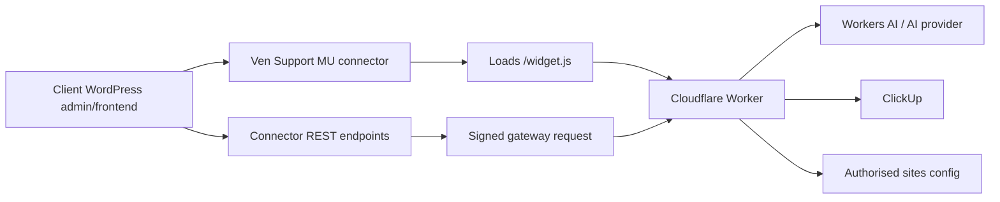

# Ven Agency Support

Ven Agency Support is the Ven-controlled website support assistant used to provide authorised client websites with guided help, AI-assisted troubleshooting, screen annotations, safe WordPress actions, and AI-routed ClickUp support task creation.

This repository is the source of truth for the support assistant. New WordPress installs should use the small must-use connector, which loads the Cloudflare-hosted widget and keeps the design/functionality centrally controlled by Ven.

## What This Project Contains

- `wordpress/mu-plugins/ven-support-connector.php` - the stable WordPress MU connector for new Ven-managed installs.
- `ven-agency-support/` - the legacy WordPress plugin package kept for existing installs and update compatibility.
- `cloudflare/ven-support-task-gateway/` - the Ven-managed Cloudflare Worker gateway.
- `.github/workflows/release.yml` - release packaging for the legacy plugin ZIP and MU connector ZIP.
- `readme.txt` - WordPress plugin metadata and changelog.
- `docs/` - operating notes for site authorisation, security, releases, and client installation.

## Architecture

The product is split deliberately:

1. The WordPress MU connector is the only site-side install for Ven-managed WordPress sites. It loads the Cloudflare widget, checks the logged-in user's WordPress capability, exposes narrow REST endpoints, signs gateway requests, and passes safe screen context to the gateway.
2. The Cloudflare Worker serves `/widget.js`, verifies the client site, controls feature flags, calls Workers AI or the fallback AI provider, and creates ClickUp tasks using Ven-held credentials when the AI decides Ven team follow-up is needed.
3. Client WordPress sites never receive the ClickUp API token or AI provider credentials. The browser widget never receives the site shared secret.



## WordPress MU Connector

For new Ven-managed WordPress sites, install the connector as a must-use plugin:

```text
wp-content/mu-plugins/ven-support-connector.php
```

The connector loads automatically and does not appear in the normal Plugins screen with a deactivate/delete button.

Configure each client site in `wp-config.php` or through host-level environment constants:

```php
define( 'VEN_SUPPORT_GATEWAY_URL', 'https://ven-support-task-gateway.ven-agency.workers.dev' );
define( 'VEN_SUPPORT_SITE_ID', 'tws-ven-com-au' );
define( 'VEN_SUPPORT_SITE_SECRET', getenv( 'VEN_SUPPORT_SITE_SECRET' ) );
```

Optionally set `VEN_SUPPORT_WIDGET_URL` when the widget is served from a custom domain instead of the same gateway:

```php
define( 'VEN_SUPPORT_WIDGET_URL', 'https://support.ven.com.au/widget.js' );
```

The site ID and secret must match the matching entry in the Worker's `AUTHORIZED_SITES` secret.

Legacy `TW_SOLAR_SUPPORT_*` constants are still supported so the first production install can migrate without breaking, but new sites should use the `VEN_SUPPORT_*` constants.

## Legacy WordPress Plugin

The `ven-agency-support/` plugin is retained for existing installs and release compatibility. New Ven-hosted WordPress sites should prefer the MU connector so the actual interface is controlled by the Cloudflare-hosted script and not by a normal plugin a client can accidentally deactivate.

## Cloudflare Worker Gateway

The Worker lives in `cloudflare/ven-support-task-gateway/`.

Required Cloudflare Worker secrets:

- `AUTHORIZED_SITES` - JSON map of allowed client sites.
- `CLICKUP_TOKEN` - Ven Agency ClickUp API token.

Optional Worker variables or secrets:

- `DEFAULT_CLICKUP_LIST_ID` - fallback ClickUp list when a site entry does not include `clickupListId`.
- `OPENAI_API_KEY` - fallback AI provider key when Workers AI is not bound.
- `OPENAI_MODEL` - fallback model name.
- `OPENAI_MAX_OUTPUT_TOKENS` - fallback output limit.

The Worker is configured for Workers AI and defaults to `@cf/google/gemma-4-26b-a4b-it` through the `CF_AI_MODEL` variable in `wrangler.jsonc`.

## Authorising A Site

Add a site entry to the `AUTHORIZED_SITES` Worker secret.

```json
{
  "tws-ven-com-au": {
    "enabled": true,
    "chatEnabled": true,
    "ticketsEnabled": true,
    "secret": "<site-specific-shared-secret>",
    "allowedOrigins": ["https://tws.ven.com.au"],
    "clickupListId": "901611479405",
    "tags": ["tw-solar"],
    "title": "Ven Support",
    "intro": "Ask Ven for help with this website.",
    "aiModel": "@cf/google/gemma-4-26b-a4b-it",
    "aiInstructions": "You are Ven Agency website support. Keep replies concise, use screen annotations to show users what to do, move users to safe same-site WordPress screens when they ask to be taken somewhere, prepare confirmed post/page updates when the user asks for exact data changes, and create a support ticket when Ven implementation work is needed."
  }
}
```

Use a long random shared secret per client site. Keep it in the client host's secure environment or `wp-config.php`, not in a theme repository.

Set `enabled` to `false` to remotely hide the assistant for a site after the connector's short settings cache expires.

## Request Flow

1. WordPress requests `/site-config` to check whether the assistant is enabled.
2. The MU connector loads `/widget.js` only when the Worker says the site is enabled.
3. The widget calls same-site WordPress REST endpoints exposed by the connector.
4. The connector signs gateway requests with `HMAC-SHA256(timestamp.body)`.
5. The Worker verifies site ID, timestamp freshness, signature, and allowed origin.
6. Chat requests include sanitized screen context such as visible headings, controls, links, and element positions.
7. Chat requests are routed through Ven-controlled AI.
8. If the AI determines Ven team follow-up is needed, the Worker creates a ClickUp task in the configured list.

## Security Model

- Every site has its own site ID and shared secret.
- The Worker rejects requests with missing headers, old timestamps, invalid signatures, or unapproved origins.
- ClickUp and AI credentials are stored only in Ven-controlled Cloudflare Worker secrets.
- Temporary WordPress access is not granted by the connector chat assistant.
- The assistant does not execute arbitrary PHP, SQL, JavaScript, shell commands, or filesystem writes.
- AI tool calls render suggested actions, draw screen annotations, prepare confirmed post/page updates, or create a ClickUp support task through the Worker.
- Data updates are limited to post/page title, content, and excerpt fields and still require the logged-in user to confirm the action in WordPress.

## AI And Tool Use

The current Worker exposes these safe tools to the AI layer:

- `open_admin_screen` - legacy admin navigation tool; normalized into direct same-site navigation.
- `navigate_site` - navigates the current browser to a safe same-site WordPress admin or frontend path.
- `annotate_screen` - highlights an exact visible element or labeled form control from the sanitized screen context.
- `propose_page_change` - drafts a page/content change for user review.
- `update_post_data` - prepares a confirmed post/page title, content, or excerpt update.
- `create_support_ticket` - creates a ClickUp task for Ven team follow-up when implementation work is needed.

The Cloudflare-hosted widget renders returned tool calls as actions. Data updates are applied only after the logged-in WordPress user clicks the confirmation button and passes the relevant WordPress capability check through the connector.

Chat transcripts persist in the browser using a site/user-scoped local key so the assistant can restore recent context across admin/frontend navigation, reloads, and browser sessions without sending secrets to the repository.

When an answer needs to navigate first, the assistant stores a short pending continuation and resumes the original request on the destination screen so it can highlight the relevant field there.

When the user explicitly asks for support or the AI determines a Ven human should investigate, the Worker creates a ClickUp task with the current WordPress user contact details and a requested follow-up note for the team.

Future page-changing tools should be implemented as narrow, signed, capability-gated WordPress endpoints with user confirmation and a rollback path.

## Local Development

Install the project tools:

```sh
npm install
```

Prepare local-only WordPress and Worker configuration:

```sh
npm run local:setup
```

This creates or updates ignored local files:

- `.wp-env.override.json` - WordPress constants for the local test site.
- `cloudflare/ven-support-task-gateway/.dev.vars` - local Worker authorisation config.

The setup script generates a local shared secret and keeps it in those ignored files. Do not commit either file. Do not add fake ClickUp, AI, or client credentials. Add real development credentials to `.dev.vars` only when intentionally testing chat AI responses or ClickUp task creation.

Start the local Worker gateway in one terminal:

```sh
npm run worker:dev
```

The Worker dev server listens on `8796` by default so it stays separate from other local services.

Start WordPress in a second terminal:

```sh
npm run wp:start
```

The local WordPress admin is available at `http://localhost:8896/wp-admin/` with the default `wp-env` username `admin` and password `password`. The MU connector is mapped by `.wp-env.json` and loads automatically:

```sh
npm run wp:verify
```

The legacy plugin directory is also mapped for linting/release checks, but it is not activated by default in local connector testing. If you intentionally need to inspect the legacy plugin status, run:

```sh
npm run wp:verify-plugin
```

Stop WordPress:

```sh
npm run wp:stop
```

If you change the WordPress or Worker port, rerun `npm run local:setup` with `VEN_SUPPORT_LOCAL_WORDPRESS_URL`, `VEN_SUPPORT_LOCAL_GATEWAY_URL`, `VEN_SUPPORT_LOCAL_WIDGET_URL`, or `VEN_SUPPORT_LOCAL_SITE_ID` set to the exact local values you are using.

Lint the connector, legacy plugin, Worker, and local setup script:

```sh
npm run lint
```

Build release ZIPs locally:

```sh
npm run connector:zip
npm run plugin:zip
```

Deploy the Worker:

```sh
npm run worker:deploy
```

## Releases And Updates

The MU connector is distributed as a release ZIP for Ven-managed deployment. Existing legacy plugin installs still receive plugin update notices from GitHub Releases.

Release process:

1. Update the connector header version, plugin header version, `Ven_Agency_Support::VERSION`, `package.json`, and `readme.txt` stable tag/changelog.
2. Run `npm run lint`.
3. Commit and push to `main`.
4. Create a GitHub release such as `v1.4.0`.
5. The release workflow attaches `ven-support-connector.zip` and `ven-agency-support.zip` to the release.
6. Existing legacy plugin installs will surface the update on the Plugins screen during their next update check.

Manual release ZIP:

```sh
npm run plugin:zip
npm run connector:zip
gh release create v1.4.0 ven-support-connector.zip ven-agency-support.zip --repo venagency/ven-agency-support --title "Ven Agency Support 1.4.0" --notes "Release notes"
```

## Client Website Repositories

Client website repositories should not own the support assistant internals. New Ven-managed WordPress sites should:

- receive the MU connector at `wp-content/mu-plugins/ven-support-connector.php`,
- define `VEN_SUPPORT_GATEWAY_URL`,
- define the client-specific `VEN_SUPPORT_SITE_ID`,
- store the client-specific `VEN_SUPPORT_SITE_SECRET` securely,
- leave AI, ClickUp, site authorisation, and feature flags in the Ven-managed Worker.

This keeps client site work focused on the client website while support assistant development stays in this repository.
